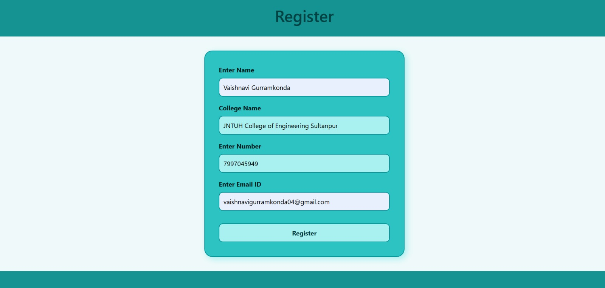
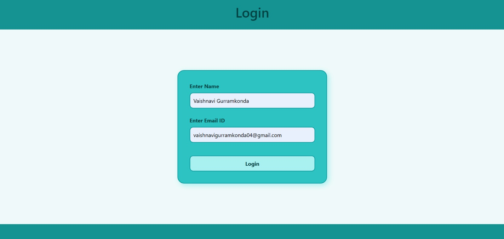
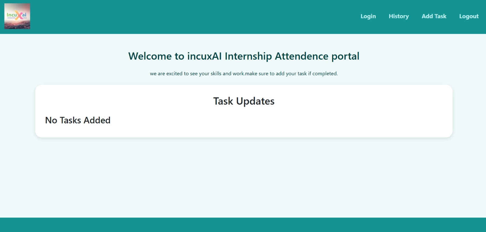
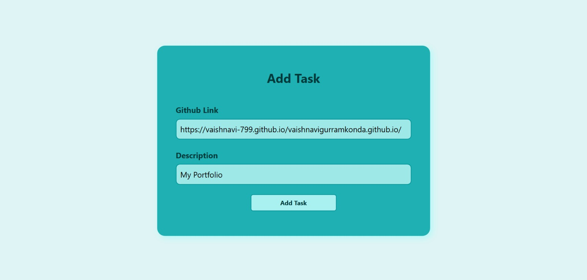
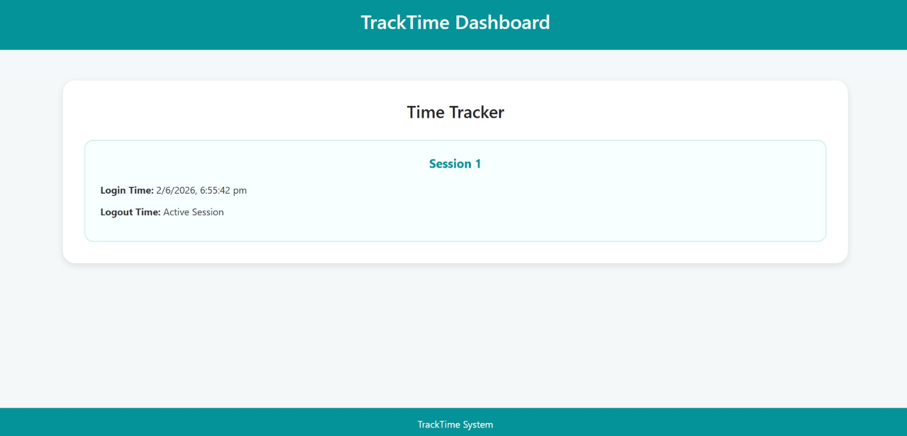
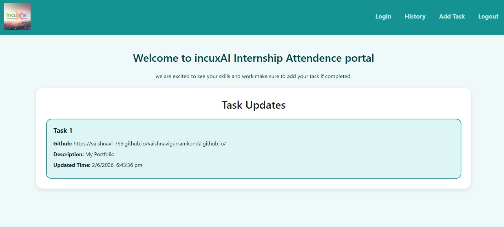
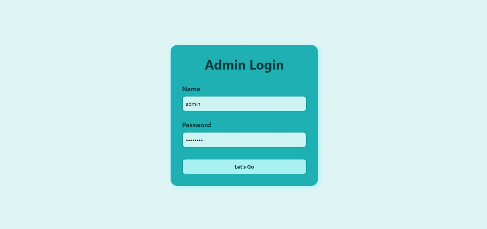
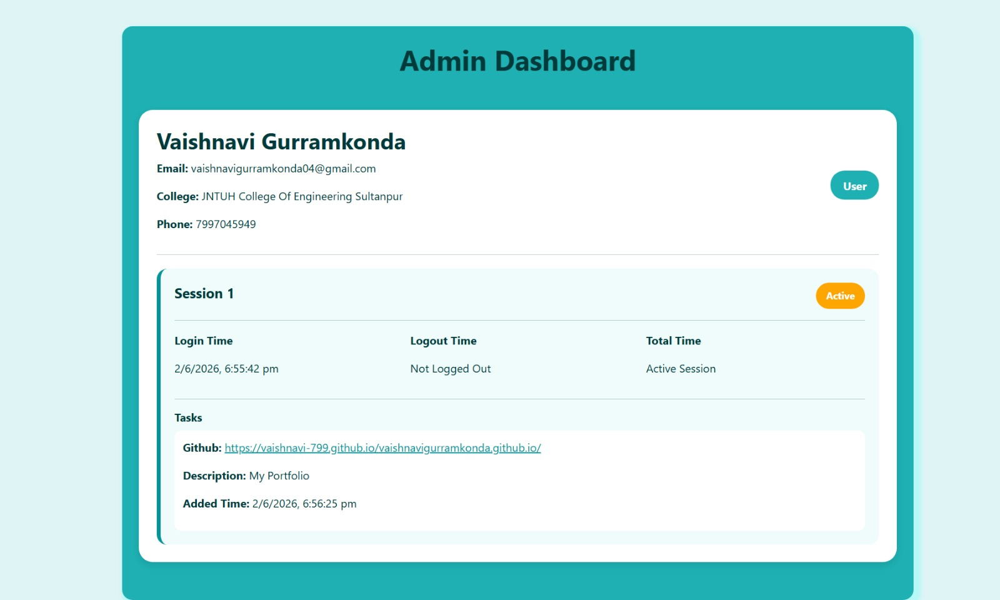

# Online Attendance Tracking Portal

## 📌 Project Overview

Online Attendance Tracking Portal is a full-stack web application developed using:

* HTML
* CSS
* Bootstrap
* JavaScript
* Node.js
* Express.js
* MongoDB

The system helps users:

* Register/Login
* Add daily tasks
* Track login/logout history
* Calculate working hours
* View task updates

It also includes an Admin Panel where admin can:

* View all users
* View user tasks
* View login/logout sessions
* Monitor working time

---

# 🚀 Features

## 👤 User Features

* User Registration
* User Login
* Add GitHub Task Updates
* View Task Dashboard
* View Login/Logout History
* Working Time Calculation
* Logout Functionality

---

## 👨‍💻 Admin Features

* First-time Admin Registration
* Secure Admin Login
* View All Registered Users
* View User Tasks
* View User Login/Logout Sessions
* View Total Working Hours
* Active Session Monitoring

---

# 🛠️ Technologies Used

## Frontend

* HTML5
* CSS3
* Bootstrap 5
* JavaScript

## Backend

* Node.js
* Express.js

## Database

* MongoDB

---

# 📂 Project Structure

```bash
tracktime_project/
│
├── backend/
│   │
│   ├── models/
│   │   ├── User.js
│   │   ├── Task.js
│   │   ├── History.js
│   │   └── Admin.js
│   │
│   ├── routes/
│   │   ├── userRoutes.js
│   │   ├── taskRoutes.js
│   │   ├── historyRoutes.js
│   │   └── adminRoutes.js
│   │
│   ├── server.js
│   ├── package.json
│   └── .env
│
├── frontend/
│   │
│   ├── Registration.html
│   ├── login.html
│   ├── Dashboard.html
│   ├── AddTask.html
│   ├── History.html
│   ├── Logout.html
│   ├── AdminLogin.html
│   └── AdminDashboard.html
│
└── README.md
```

---


## 🗄️ MongoDB Database
Database Name
 * tracktime
   
 Collections
 * users
 * tasks
 * histories
 * admins

---

# ⚙️ Installation Process

## 1️⃣ Clone Repository

```bash
git clone <your-github-repository-link>
```

---

## 2️⃣ Open Project Folder

```bash
cd tracktime_project
```

---

# 🔥 Backend Setup

## 1️⃣ Move to Backend Folder

```bash
cd backend
```

---

## 2️⃣ Install Dependencies

```bash
npm install
```

---

## 3️⃣ Install Required Packages

```bash
npm install express mongoose cors dotenv nodemon
```

---

## 4️⃣ Start MongoDB

Open new CMD terminal and run:

```bash
mongod
```

Keep it running.

---

## 5️⃣ Run Backend Server

```bash
npm run dev
```

OR

```bash
node server.js
```

---

# 🌐 Frontend Setup

Open frontend folder and run:

```bash
Registration.html
```

using:

* VS Code Live Server
  OR
* Browser directly

---

# 🗄️ MongoDB Database

Database Name:

```bash
tracktime
```

Collections:

```bash
users
tasks
histories
admins
```

---

# 📊 API Endpoints

## User Routes

| Method | Endpoint  | Description   |
| ------ | --------- | ------------- |
| POST   | /register | Register User |
| POST   | /login    | User Login    |

---

## Task Routes

| Method | Endpoint      | Description    |
| ------ | ------------- | -------------- |
| POST   | /add-task     | Add Task       |
| GET    | /tasks/:email | Get User Tasks |

---

## History Routes

| Method | Endpoint        | Description        |
| ------ | --------------- | ------------------ |
| POST   | /logout         | Update Logout Time |
| GET    | /history/:email | Get Login History  |

---

## Admin Routes

| Method | Endpoint     | Description          |
| ------ | ------------ | -------------------- |
| POST   | /admin-login | Admin Login/Register |
| GET    | /admin-data  | Get All Users Data   |


---











--

